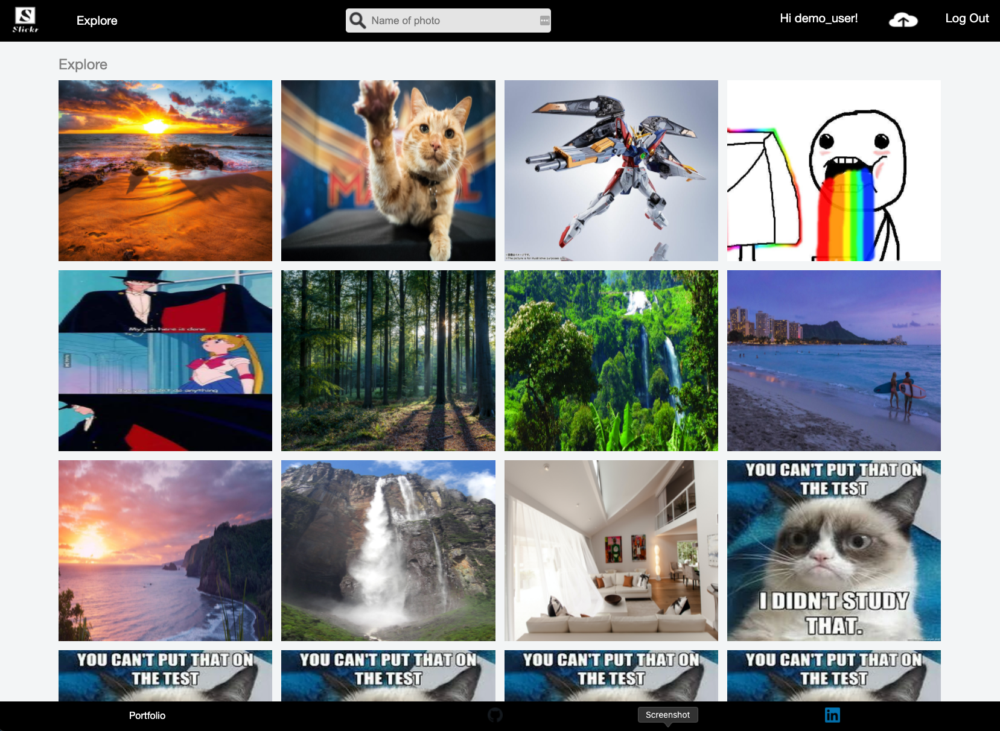
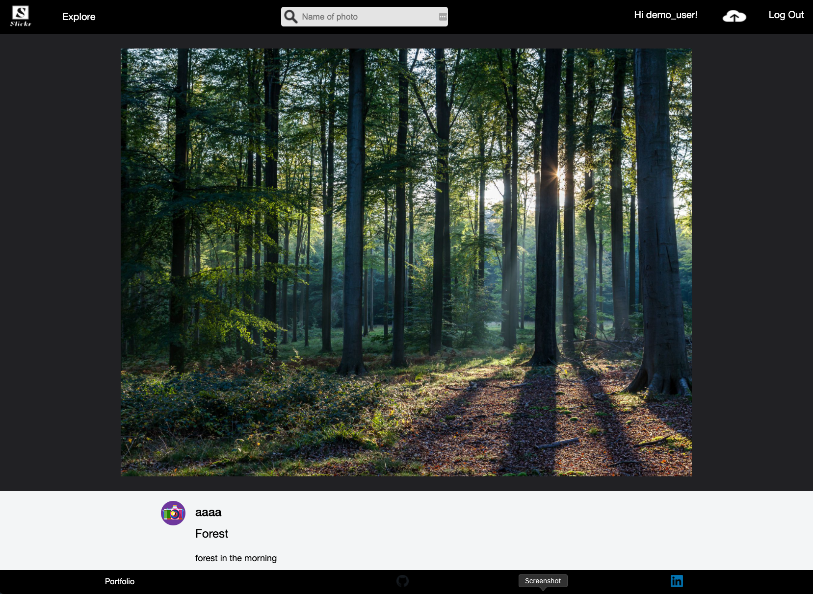

<h1><a href="http://127.0.0.1:3000/#/"> Slickr </a></h1>

<p>Table of Contents</p>
<ul>
    <a href="#background"><li>Background</li></a>
    <a href="#technologies"><li>Technologies, Libraries, APIs</li></a>
    <a href="#core-features"><li>Core Features</li></a>
</ul>
 
<h2 id="background">Background</h2>
Slickr is a clone of a social image hosting website called flickr. The site allows users to save and share their photos with others around the world.

<h2 id="technologies">Technologies, Libraries, APIs</h2>
 <ul>
  <li>Ruby on Rails</li>
  <li>PostgreSQL</li>
  <li>Rails Active Storage with Amazon's S3</li>
  <li>React.js</li>
  <li>Redux</li>
 </ul>

<h2 id="core-features">Core Features </h2>
 <ul>
   <h4>Photos</h4>
   <li>Users are able to upload images</li>
   <li>All photos are shown in explore</li>
   <li>Photo owners are able to edit their photo title and description</li>
   <li>They are also able to delete their photo</li>
   <li>Other users are able to comment and like a photo</li>
 </ul>

```JSX
  render(){
    // debugger
    const {photos} = this.props;
    const query = this.props.location.search.slice(1);

    if(!photos) return null;

    const filteredPhotos = photos.filter(photo => {
      return photo.title.toLowerCase().includes(query.toLowerCase());
    })

    const filteredPhotoItem = filteredPhotos.map(photo =>{
      return (
        <SearchIndexItem
          key={photo.id}
          photo = {photo}
        />
      )
    })

    if (query !== "" && filteredPhotoItem.length > 0) {
      return (
        <div className='search-index'>
          <div className="search-index-header">
            <h1>Search</h1>
          </div>
          <div className="search-index-item">
            {filteredPhotoItem}
          </div>
          <Footer/>
        </div>

      )
    } else {
      return (
        <div className='search-index-empty'>
          <div className='no-search-top'>
              {`No results for "${query}"`}
          </div>
          <div className='no-search-bottom'>
              Try again?
          </div>
        </div>
      )
    }
  }
}
```

 <ul>
  <h4>Search</h4>
  <li>Users are able to search photos by name</li>
 </ul>
